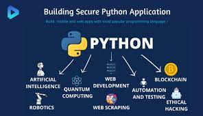

# Pyrash(Python-Crash) Course Solutions

## Here, you will find the Solutions to the **"Try it yourself"** challenges inside the "Python Crash Course book attached, to guide you through your learning with really cool, fun and real world examples.

> I have been here before tryin find my way around the python's neck without catchin some venom and trust me in no time, you will be as well in position to write solutions/steps for others.

### The challenges are commented out at the top of each file.

### An explicit approach to the challenge is then explained in the documentation tripple quotes

> **The solution is the runable program body**

### And finally some "Take Away" examples that might be from another context but relative to the topic

# Hey Developer
## Feel free to contribute to the solutions after your learning  ---> probally funny examples

- Happy Learning

- Cheers

<m.silverbuckson@gmail.com>
